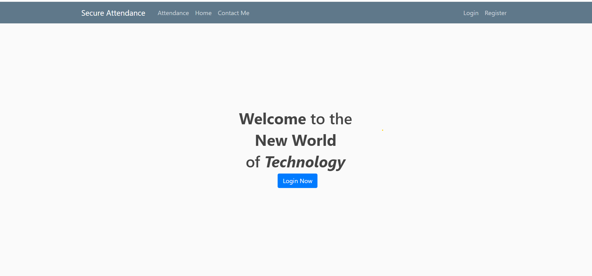
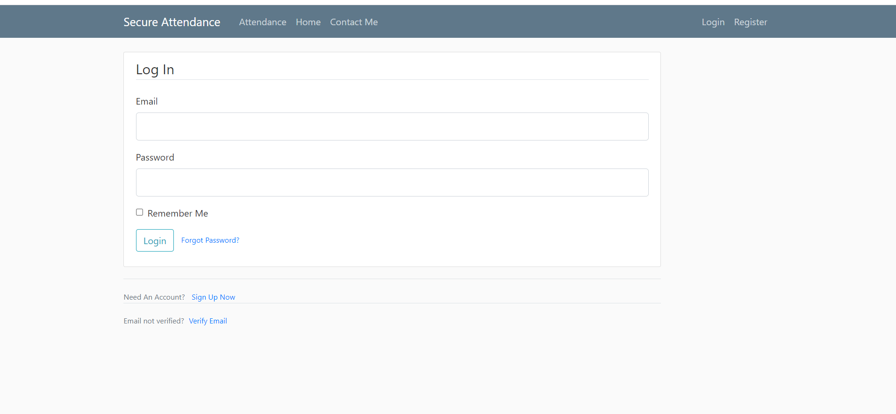
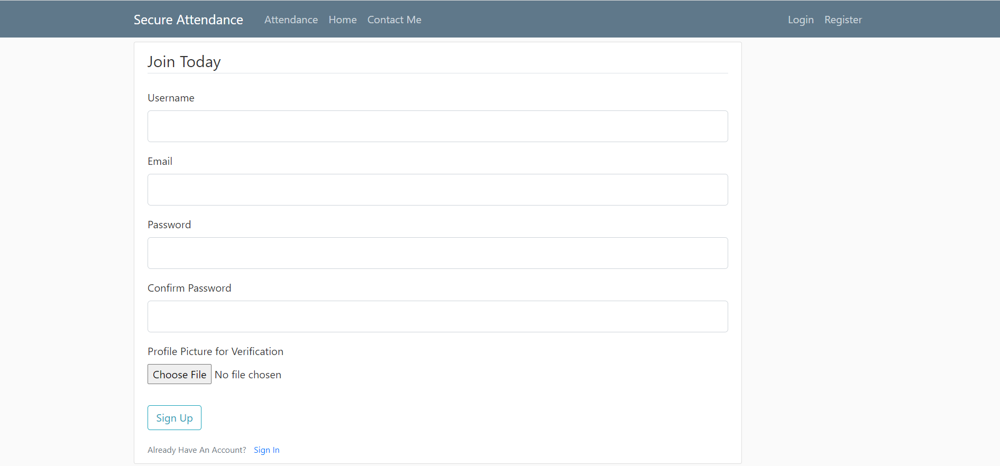
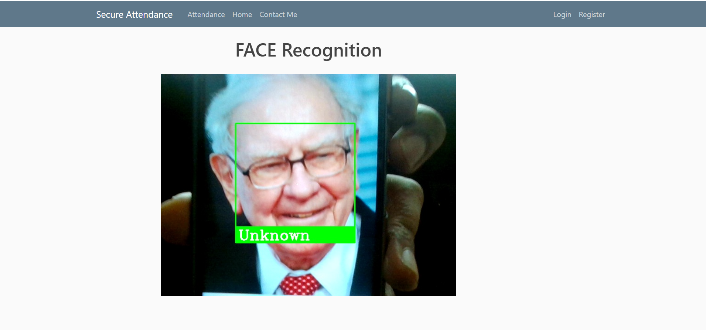
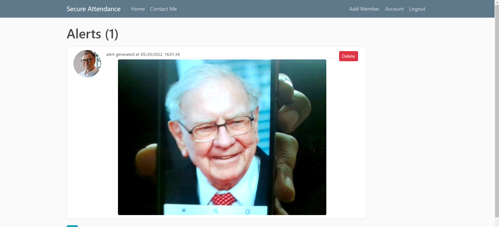
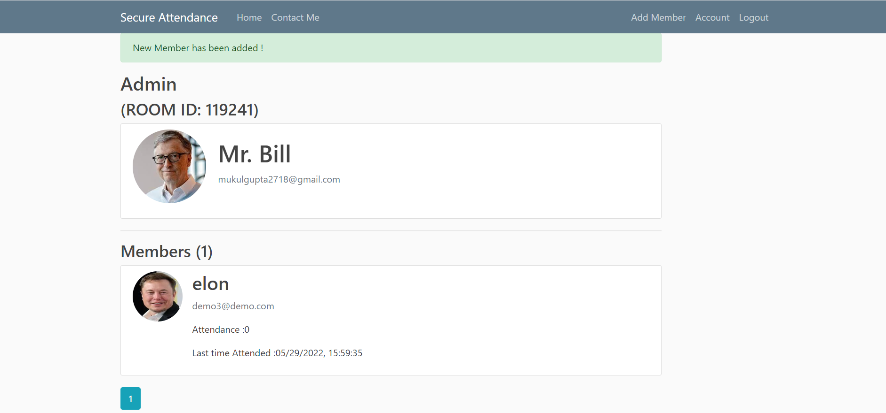
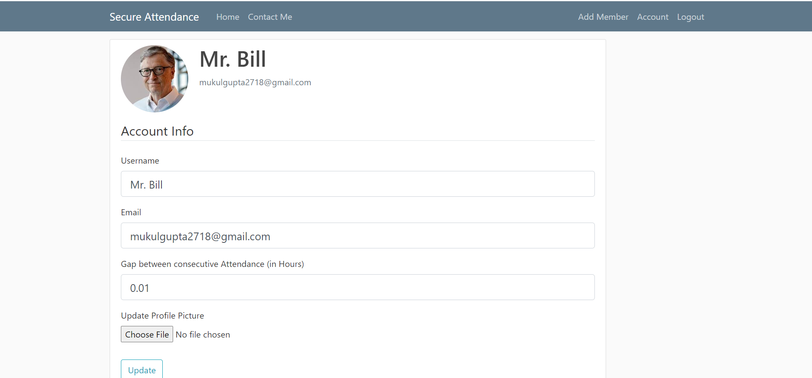

# Secure-Attendance
Engage 2022 Face Recognition Project:\
This is a browser based webite of Attendance system using Face Recognition. User can simply create an account and then add members of his organisation using a single picture.

## Demo

[https://drive.google.com/drive/folders/1ugAVsy52aAj3f0CXNI87wSpCy0XjV5w2?usp=sharing](https://drive.google.com/file/d/14t8G3Lix9lY-6OXEeX3-p_nvnbA2yRYm/view?usp=sharing)


## Features

- Multiple Users (admins) can be created
- Alerts are generated if unknown person is trying to mark the attendance 
- Time Gap between two consecutive attendance of members can be customised for each admin
- Face recognition decision takes place on the mode of 5 consecutive frame decision
- Email Verification
- Password reset via email 
- passwords stored in database are hashed 
- Details of each member and admin can be updated 


## Screenshots
Home Page


Login Page


Registration Page


Attendance Page


Alerts Page


Account Page


Update Account Page


## Run Locally

Clone the project

```bash
  git clone https://github.com/mukulgupta2702/Secure-Attendance.git
```

Install dependencies

```bash
  pip install -r .\requirements.txt  
```

Start the server

```bash
  python .\app.py
```

## Note

- python 3.8 or 3.7 should be used for face_recognition library to work 
- initially the gap between two consecutive attendance of a person is set at 0.01hours or 36 sec for demonstrations and this can be changed from update account page
- the attendace window will freeze after 6 frames if an unknown person is detected 
- In normal cases the attendance window will close after 120 sec
